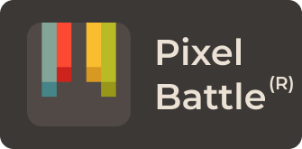

 

<a href="https://pixelbattle.fun">Game</a> |
<a href="https://discord.gg/XBPyGUv3DT">Discord</a> |
<a href="https://help.pixelbattle.fun/">Help</a> |
<a href="https://help.pixelbattle.fun/schedule">Schedule</a>

Unleash your <strong>creativity</strong>  in canvas with hundreds of players

## Usage
1. You can view live version of this game on [pixelbattle.fun](https://pixelbattle.fun)

**or you can run it locally:**

1. PixelBattle uses vite, so you can preview it with `npm run preview`
2. To set token and id, either go to `localhost/?token={YOUR_TOKEN}&id={YOUR_ID}` or manually set it in localstorage and reload

## Features compared to previous client
* Color picker
* Super fast
* Better mobile support
* Better usage of canvas
* Improved interface 

## Screenshots

